# wg_forge_back 

## Мартовские коты

Установить .NET Core 2.2 https://dotnet.microsoft.com/download/dotnet-core/2.2 Для Вашей ОС

Установить PostgresQL https://postgrespro.ru/docs/postgresql/10.0/tutorial-install

Клонировать репозиторий
Собрать проект: dotnet restore

Используемые  SDK и пакеты
    Microsoft.NET.Sdk.Web
    netcoreapp2.2
    AspNetCoreRateLimit" Version="3.0.2
    Microsoft.AspNetCore.App
    Microsoft.AspNetCore.Razor.Design" Version="2.2.0" PrivateAssets
    Npgsql.EntityFrameworkCore.PostgreSQL" Version="2.2.0
    NpgSql.EntityFrameworkCore.PostgreSQL.Design" Version="1.1.1"
    
  Настроить доступ к БД в файле appsetting.json
  "DefaultConnection":
    "Host=localhost;Port=5432;Username=вашuser;Password='пароль';Database=wg_forge_backend;"
    
  Выполнить команду в терминале в папке решения:
  dotnet ef database update
  Будет создана БД с таблицами.
  
  Заполнить таблицу Cats начальными значениями через SQL запрос в соответсвии с заданием.
  
  Запускаем приложение dotnet run
  
  
Для тестирования используем PostMan
Начальная страница http://localhost:8080
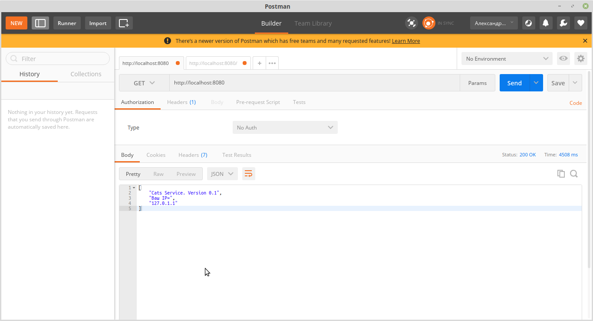

http://localhost:8080/ping

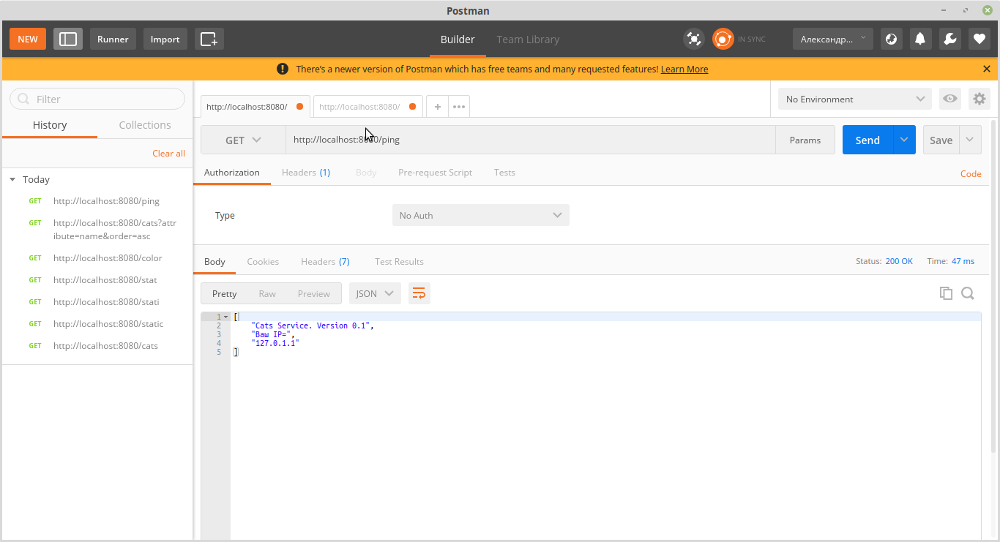

http://localhost:8080/cats

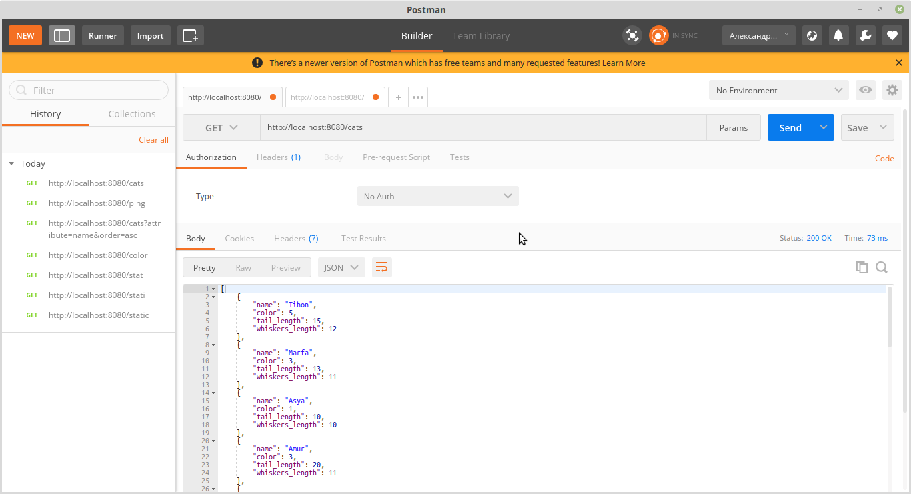

http://localhost:8080/color сколько котов каждого цвета есть в базe и записать эту информацию в таблицу cat_colors_info:

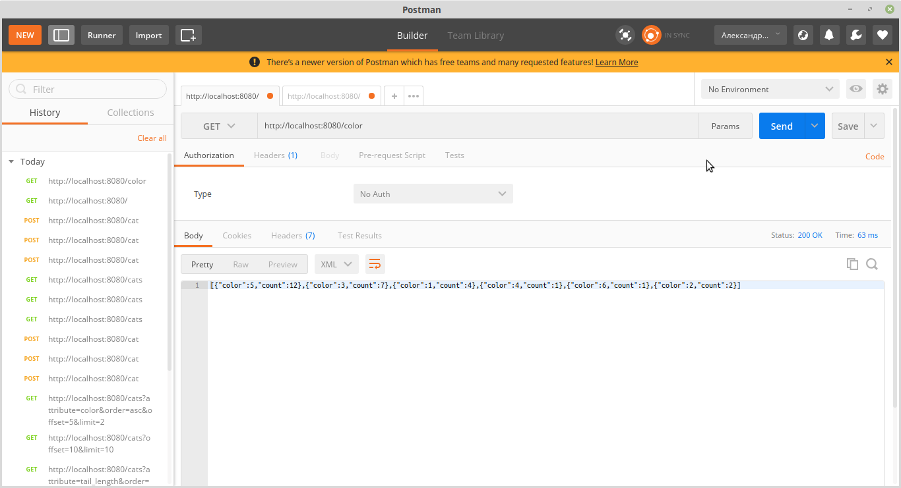

http://localhost:8080/stat Анализ наших котов и сохрание этой информации в таблицу cats_stat:

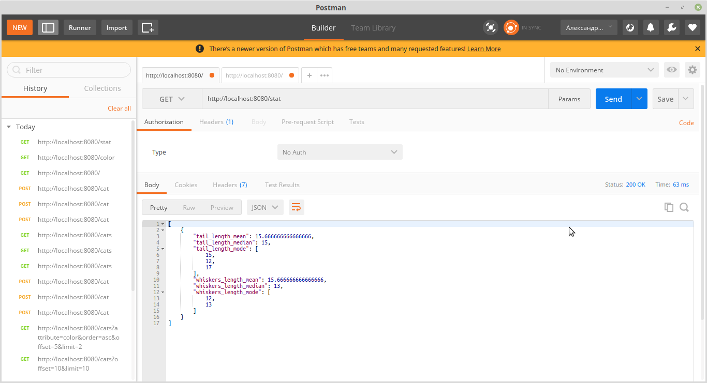

http://localhost:8080/cats?attribute=name&order=asc

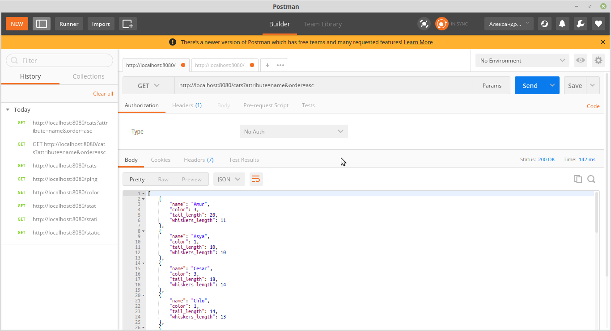

http://localhost:8080/cats?attribute=tail_length&order=desc

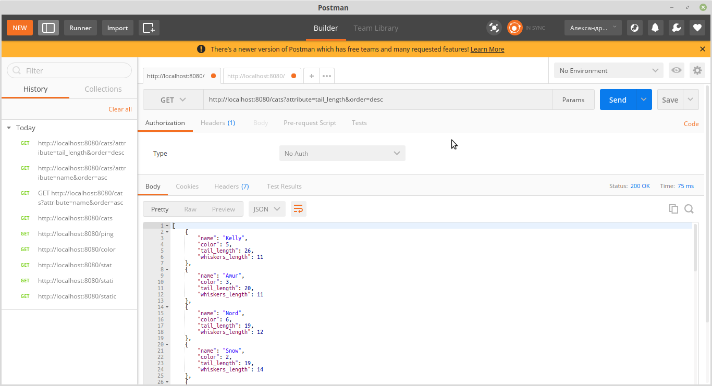

http://localhost:8080/cats?offset=10&limit=10

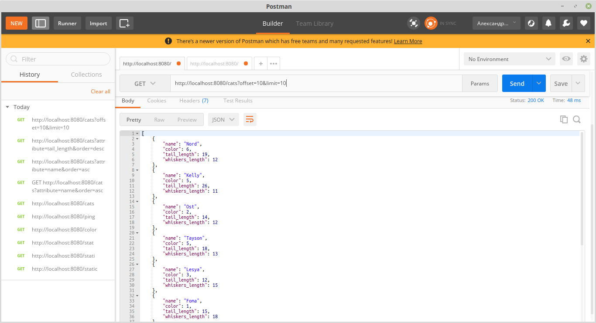

http://localhost:8080/cats?attribute=color&order=asc&offset=5&limit=2

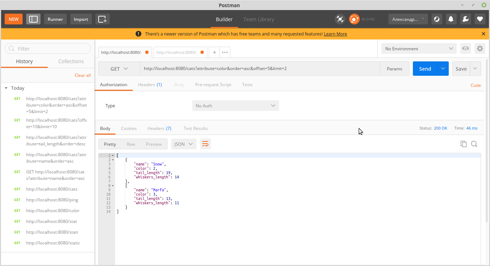

POST Запрос http://localhost:8080/cat с JSON Body {"name":"Tihon-","color":5,"tail_length":15,"whiskers_length":12}

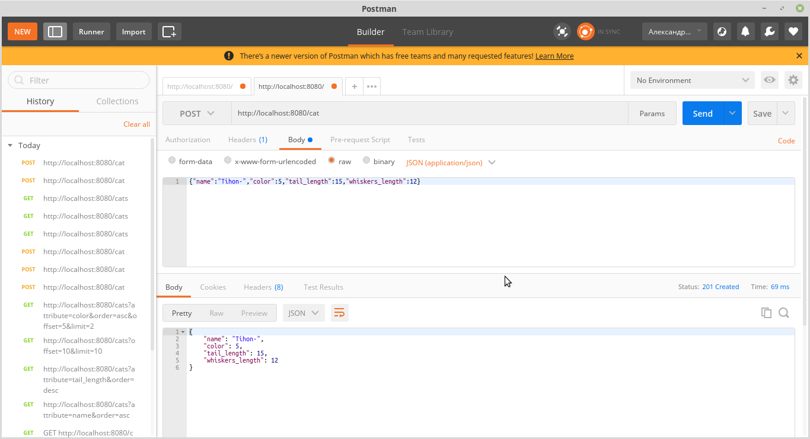

POST Запрос http://localhost:8080/cat с JSON Body {"name":"Tihon-","color":5,"tail_length":15,"whiskers_length":-12

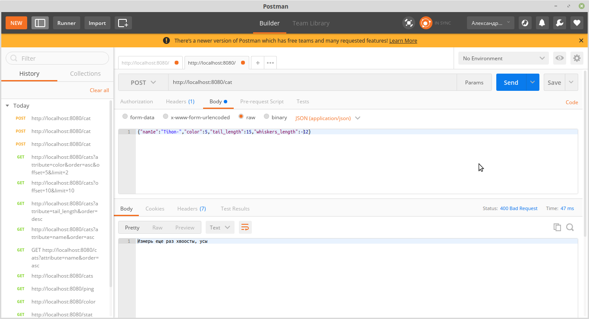

Проверка (Примитивная) на нагрузку при установленных параметрах не белее 3 за три секунды, параметр можно менять в appsetting.json 
"GeneralRules": [
        {
          "Endpoint": "*",
          "Period": "3s",
          "Limit": 3
        },
        

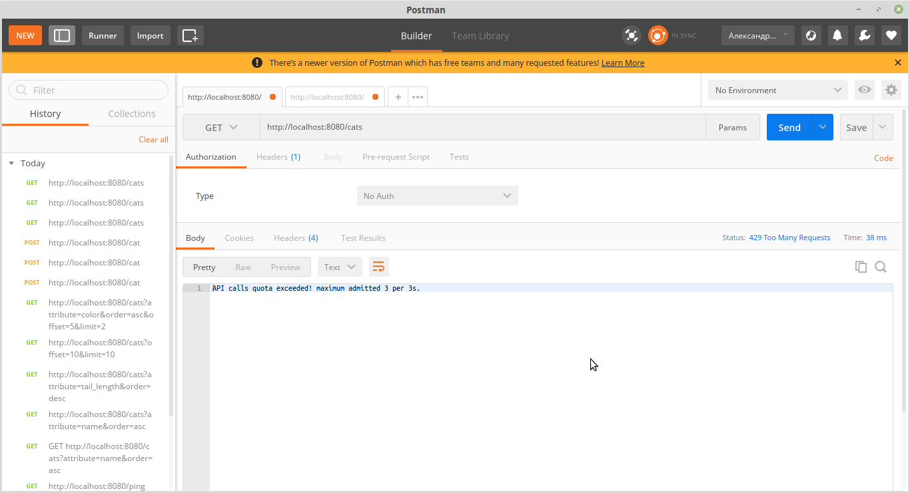

P.S. Unit Test не делал, по причине что их никогда не делал, поэтому не все исключительные ситуации отловлены в этом замечательном приложении о **'Мартовских котах'**;

P.S. № 2 Оказывается нечего нет проще чем сделать нагрузочное тестирование используя замечательный инструмент POSman (наверное)
      "GeneralRules": [
        {
          "Endpoint": "*",
          "Period": "1m",
          "Limit": 600
        }
        
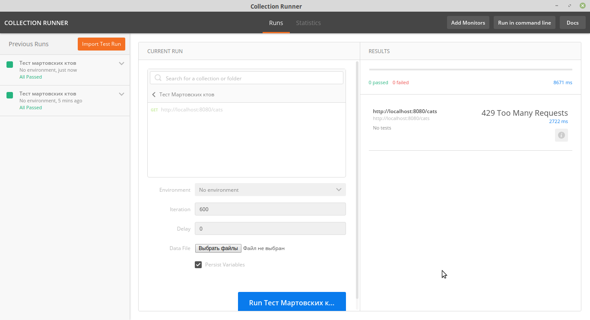
